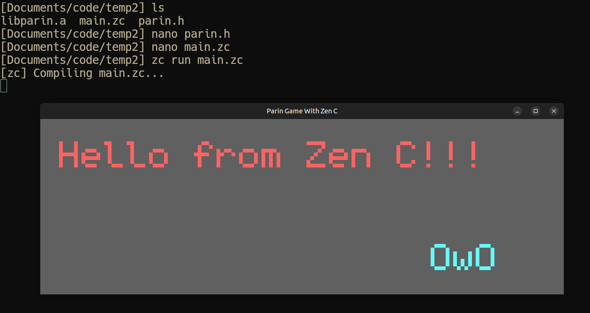

# Zen C + Parin

A basic example using the [Zen C programming language](https://github.com/z-libs/Zen-C) with [Parin](https://github.com/Kapendev/parin).



## How

The normal way to get something running would be to clone Parin, add a C layer, and compile it.
This repo already includes a precompiled Linux version that has 4-5 C functions.
Compile and run with:

```sh
zc run main.zc
```
